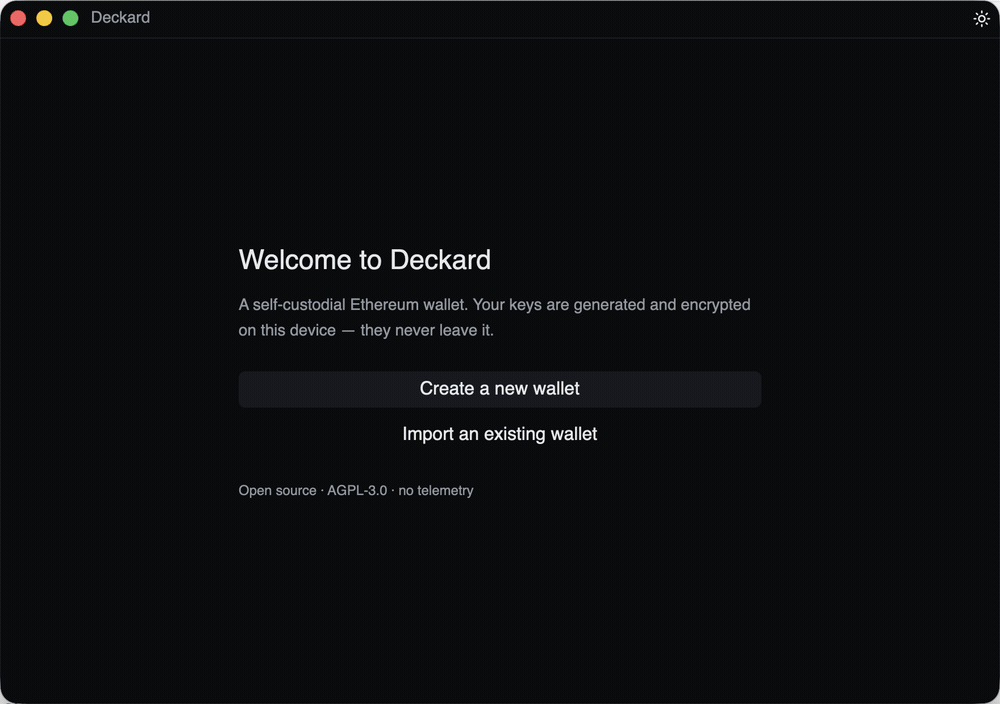

# Deckard

A fast, keyboard-first, **self-custodial Ethereum wallet** for people who live onchain —
with an **agent surface that cannot move your funds without policy.** Native (macOS + Linux),
trustless by construction, open source.

> ## ⚠️ v0.0.1-alpha — EXPERIMENTAL. NOT for production.
> This is **pre-1.0, experimental software** with **no third-party security audit**.
> **Do NOT use it with real funds or real mainnet keys.** Use **testnet / throwaway keys only**,
> and run the demo on a **local Sepolia fork** (below). It can lose your money or break at any
> time. You have been warned.

**The falsifiable claim:** *a prompt-injected agent cannot move your funds* — every write is
policy-gated inside a **separate signer process** that holds the key (the agent surface is
key-less), and on **mainnet every auto-allow is downgraded to an in-app human approval**.
That is the whole design; if you can cross a boundary it claims, that's a vulnerability — see
[`THREAT-MODEL.md`](THREAT-MODEL.md) and [`SECURITY.md`](SECURITY.md).



> _From the current build on a local Sepolia fork: funded wallet (100% public) → command palette →
> shield review (clear-signing) → the public-to-private flip. UI polish is still in flight; the
> final cut lands with it ([`docs/RELEASING.md`](docs/RELEASING.md) §4)._

> Forked from the [`deck`](https://github.com/hellno/deck) GPUI starter (0BSD, which permits
> relicensing). Now its own project: Rust + [GPUI](https://www.gpui.rs/), licensed AGPL-3.0-or-later.

Why this exists: [the manifesto](docs/MANIFESTO.md).

---

## Start here: clone → ask Claude to shield ETH

This is the full canonical path on a **local Sepolia fork** (no real funds, ever). It stands up
a forked chain, the app, the process-isolated signer daemon, and the agent (MCP) sidecar, then
hands the wheel to Claude Desktop.

> **Heads-up — cold GPUI build.** The first build compiles the whole GPUI stack from source and
> is **slow** (many minutes; can exceed ~10 min on a cold machine). `just demo` runs that build
> before the app window appears. Subsequent runs are incremental and fast.

> **Quick prompt to first shielded transaction: under a minute.** Measured 2026-06-12 on a
> running `just demo` (fresh `claude -p` session, the quick prompt below, doc fetched over the
> network): policy read at ~20 s, shield proposed at ~28 s, transaction broadcast at ~32 s,
> agent done at ~38 s. The cold GPUI build above is stated separately, not folded into this
> number.

### Prerequisites

- **Rust toolchain** — pinned in `rust-toolchain.toml`; `rustup` selects it automatically inside
  the repo (no manual channel switch).
- **`just`** — `brew install just` (macOS) or `cargo install just` (any platform).
- **Foundry** (`anvil` + `cast`) — `brew install foundry` (macOS), or
  `curl -L https://foundry.paradigm.xyz | bash && foundryup` (any platform).
- **A Sepolia _archive_ RPC** — this is anvil's upstream fork source (it is **not** read by
  any Deckard binary). The **zero-setup option is the keyless public endpoint** — no signup, no
  key (it may rate-limit; for heavy use get a free keyed endpoint from Alchemy/Infura/dRPC):

  ```sh
  export RPC_URL_SEPOLIA=https://sepolia.drpc.org          # keyless — works out of the box
  # or a free keyed endpoint:
  # export RPC_URL_SEPOLIA=https://eth-sepolia.g.alchemy.com/v2/<your-key>
  ```

  > It only needs **archive depth at the pinned fork block** (`10822990`, where the Railgun
  > contracts live) — verify with `cast block 10822990 --rpc-url "$RPC_URL_SEPOLIA"`.
  > Local Railgun shield/swap testing is documented in
  > [`docs/dev/railgun-local-testing.md`](docs/dev/railgun-local-testing.md).

### macOS (Claude Desktop)

```sh
git clone https://github.com/hellno/deckard
cd deckard
export RPC_URL_SEPOLIA=https://eth-sepolia.g.alchemy.com/v2/<your-key>

just demo            # terminal 1: anvil fork of Sepolia + the app & daemon (leave running; Ctrl-C tears anvil down)
                     #   -> in the app: CREATE A THROWAWAY WALLET (never a real seed) and UNLOCK it

just demo-fund       # terminal 2: fund the onboarded wallet with 10 ETH on the fork

cargo build -p deckard-mcp   # one-time: the sidecar isn't on PATH; builds ./target/debug/deckard-mcp
./target/debug/deckard-mcp install --demo   # print the Claude Desktop registration (key-less; demo env only)
                     #   -> merge it / re-run with --write, then RESTART Claude Desktop
```

Then paste the **quick prompt** into a fresh Claude Desktop chat:

```text
Read https://github.com/hellno/deckard/blob/main/docs/build/31-agent-quickstart.md — then
check my Deckard wallet policy and shield 0.02 ETH, staying inside the policy caps.
```

Claude reads the [agent quickstart](docs/build/31-agent-quickstart.md), calls
`deckard_policy_get` → `deckard_shield` → `deckard_execute`; the daemon enforces policy and
signs; the split-balance bar flips public → private on screen.

> Stuck? Run **`just demo-check`** — it verifies foundry, `RPC_URL_SEPOLIA`, the local fork, the
> signerd build, and that the app is running + unlocked on the right chain, then prints the exact
> fix for each failure.

### Linux (CLI path)

Claude Desktop is macOS-only, so on Linux drive the **same daemon** through the `deckard-mcp` CLI:

```sh
git clone https://github.com/hellno/deckard
cd deckard
export RPC_URL_SEPOLIA=https://eth-sepolia.g.alchemy.com/v2/<your-key>

just demo                                # terminal 1: fork + app (create + UNLOCK a throwaway wallet)
just demo-fund                           # terminal 2: fund it
cargo build -p deckard-mcp               # one-time: builds ./target/debug/deckard-mcp (not on PATH)
./target/debug/deckard-mcp shield --amount-eth 0.02   # propose -> prints a request_id
./target/debug/deckard-mcp execute <request_id>       # sign + broadcast
./target/debug/deckard-mcp policy                     # read the active fence
```

> The demo policy caps per-tx at **0.1 ETH**; a shield **within** cap auto-allows on the Sepolia
> fork (the mainnet guardrail is inactive there), an **over-cap** shield returns `NeedsApproval`.
> Each `just demo` is a **fresh fork** — re-run `just demo-fund` and re-shield every time. Full
> demo mechanics, the env-var table, and over-cap behavior live in
> [`CONTRIBUTING.md`](CONTRIBUTING.md#demo--local-chain-dev-loop).

---

## Status

**Live build status: [`STATUS.md`](STATUS.md) — the single source of truth** (demo beats, crates, risks).

**Working today:**

- Encrypted BIP-39 keystore + onboarding (Argon2id + XChaCha20-Poly1305 at rest; secrets in `Zeroizing`).
- Live on-chain balances (Multicall3).
- Receive (address + QR).
- Command palette.
- The amber-on-near-black design system (`DESIGN.md`).
- **Helios-verified reads** — no third-party RPC is trusted by default.
- A **process-isolated signer daemon** (`deckard-signerd`) over a Unix socket that holds the key
  and gates every write.
- The **shield** hero (auto-private via [Railgun](https://railgun.org/)) — **wired and black-box
  tested on an anvil fork.**
- The **agent surface** (`deckard-mcp`): a key-less CLI **and** MCP stdio sidecar — the
  `mcp.v0.1` **9-tool** profile (`deckard_wallet_address`, `deckard_wallet_balance`,
  `deckard_policy_get`, `deckard_shield`, `deckard_execute`, `deckard_swap_quote`, `deckard_swap`,
  `deckard_submit_order`, `deckard_revoke_all`). Deliberately
  **no raw `propose` and no `resolve`**, so an injected agent can't submit an arbitrary intent or
  approve its own request.
- The **demo loop** (`just demo` / `demo-fund` / `demo-check`) on a local Sepolia fork — see
  "Start here" above.

**Not done yet (do not expect these to work):**

- **Send** UI is gated — it's the **first post-launch milestone** (the daemon + app-socket path
  is built and tested; only the UI is held back).
- **Swap** v1: agent-reachable via `deckard_swap_quote` / `deckard_swap` / `deckard_submit_order`
  (CoW Protocol); a human approves each swap in the app, and the demo fork simulates the fill.
- The **receive-watcher** auto-detect is a TODO (today you fund/refresh manually).
- No automatic idle-lock and no Touch ID yet — passphrase-only, lock is explicit.
- Some tests are `#[ignore]` (need `anvil` + an archive RPC) — see the test caveats in `STATUS.md`.

See `STATUS.md` for the beat-by-beat picture and the honest test caveats.

## Build & run

```sh
just run                 # build the signer daemon, then build + run the app (debug)
just demo                # local Sepolia-fork demo loop (see "Start here") — also: just demo-fund, just demo-check
just core                # fast engine-only inner loop (clippy + tests for deckard-core, no GPUI build)
just check               # lint both feature configs (clippy -D warnings: default AND --features tray)
cargo test --workspace   # run the test suite
just bundle              # build a macOS Deckard.app
```

The Rust toolchain is pinned in `rust-toolchain.toml`. Install [`just`](https://github.com/casey/just)
with `brew install just` (macOS) or `cargo install just` (any platform). Under the hood `just run`,
`just core`, `just check`, and `cargo test` are plain `cargo`, so you can run them by hand too.

**Linux:** the app builds with `cargo`, but GPUI needs the same system libraries Zed does — a Vulkan
loader plus the X11/Wayland and font/clipboard dev packages. Install them per
[Zed's Linux build dependencies](https://github.com/zed-industries/zed/blob/main/docs/src/development/linux.md)
before `just run`. Note that `just bundle` / `just open` / `just icon` are **macOS-only** (they shell
out to `cargo-bundle` (osx), `open`, `sips`, and `iconutil`); on Linux use `cargo build` / `cargo run`
directly.

**Definition of done** (all must hold before a change is finished):

1. `cargo fmt --all --check` is clean.
2. `just check` is green (clippy `-D warnings` on **both** the default and `--features tray` configs).
3. `cargo test --workspace` is green.
4. No new or changed dependencies in `Cargo.toml` / `Cargo.lock` unless explicitly approved.

### Crate layout

Virtual Cargo workspace; all crates live under `crates/`:

- **`deckard-app`** — the GPUI app (binary `deckard`).
- **`deckard-core`** — the headless engine: provider / verified-reads, balances, HD keys, keystore, and the
  key-less shield builder. `#![forbid(unsafe_code)]`.
- **`deckard-contract`** — the frozen wire contract (`Intent` / `Decision` / `Policy` / `RPC` / `ReadStatus`).
- **`deckard-signerd`** — the signer daemon that holds the key and gates writes.
- **`deckard-mcp`** — the key-less agent surface (CLI + MCP stdio sidecar) that proposes writes to the daemon.

## Security architecture

Real, and already built:

- **Process-isolated signer daemon** (`deckard-signerd`) over a Unix domain socket: it holds the key and
  gates every write; the app, engine, and **agent sidecar are key-less.**
- **Key-less agent surface** (`deckard-mcp`): the MCP process holds no key material — it only proposes
  typed intents to the daemon, which evaluates policy and signs. The `mcp.v0.1` profile excludes raw
  `propose`/`resolve` by design.
- **Mainnet guardrail:** while the daemon signs for chain 1, every auto-allow is downgraded to an in-app
  human approval (its override is documented in [`THREAT-MODEL.md`](THREAT-MODEL.md) only, never echoed to
  the agent).
- **Helios light-client verified reads** — no third-party RPC is trusted by default.
- **Keystore at rest** = Argon2id key derivation + an XChaCha20-Poly1305 envelope; secrets stay in `Zeroizing`.
- `deckard-core` is `#![forbid(unsafe_code)]`; the workspace lint policy denies `todo!`, `dbg!`, and ignored
  `Result`s.

This is alpha software with **no external audit yet** — treat the above as design intent under active review,
not a guarantee. The full runtime trust boundaries, residual risks, and honest tradeoffs are in
[`THREAT-MODEL.md`](THREAT-MODEL.md). Report anything sensitive privately (see below).

## Design

The visual + interaction system (typography, color, spacing, the command palette, and the
clear-signing / trust affordances) lives in [`DESIGN.md`](DESIGN.md) — the source of truth for any
UI work.

## Where to read more

- [`docs/build/31-agent-quickstart.md`](docs/build/31-agent-quickstart.md) — the canonical agent-facing quickstart: install one-liner, the 9 tools, policy fields, every deny reason with its fix, demo constants.
- [`docs/build/30-mcp-shape.md`](docs/build/30-mcp-shape.md) — the MCP / daemon-socket wire contract and the `mcp.v0.1` 9-tool profile.
- [`CONTRIBUTING.md`](CONTRIBUTING.md#demo--local-chain-dev-loop) — the demo / local-chain dev loop in full, with the `DECKARD_*` env-var table.
- [`THREAT-MODEL.md`](THREAT-MODEL.md) — what the agent surface defends against, what it does not, and the residual risks.
- [`SECURITY.md`](SECURITY.md) — the at-rest keystore model, honest caveats, and how to report a vulnerability privately.
- [`DESIGN.md`](DESIGN.md) — the design system (required reading before any UI change).
- [`STATUS.md`](STATUS.md) — the live, beat-by-beat status of what's built vs. partial vs. TODO.

## Contributing

This is **alpha software**, and money software at that — it should not be reviewed by one person. I'm
especially looking for a **security-minded co-maintainer** for the signer/policy/keystore surface. If
reviewing self-custody enforcement is your thing, please reach out.

- [`CONTRIBUTING.md`](CONTRIBUTING.md) — how to build, test, and submit changes.
- [`SECURITY.md`](SECURITY.md) — how to report a vulnerability **privately**
  (to report privately, use GitHub's **Security** tab → **Report a vulnerability**).
- [`CHANGELOG.md`](CHANGELOG.md) — what changed, release by release.

Repo: <https://github.com/hellno/deckard>.

## License

AGPL-3.0-or-later. See [`LICENSE`](LICENSE) and third-party attributions in [`NOTICE`](NOTICE).
</content>
</invoke>
